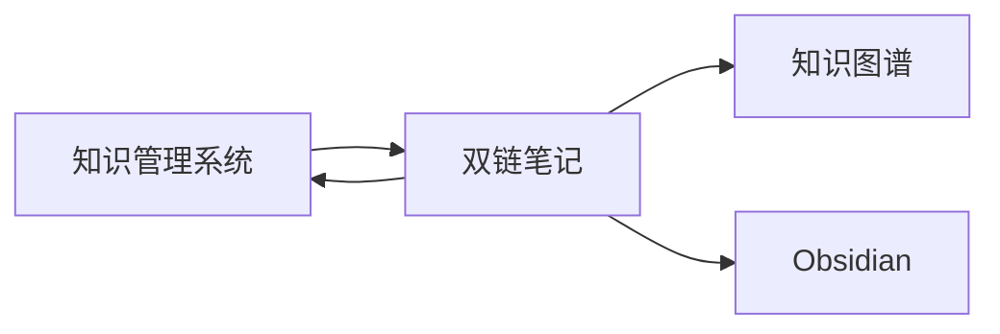

# {{双链笔记}}

## 节点元数据
```yaml
type: concept
domain: 知识管理
level: 模块层
created: 2026-03-24
updated: 2026-03-24
source: openclaw
```

## 概述

双链笔记是通过 [[双向链接]] 连接相关概念的笔记方法。在文件系统中，通过 Markdown 的 `[[主题名称]]` 语法实现，Obsidian 自动识别并建立关系图谱。

## 核心要点

- **双向链接** - A 链接 B 时，B 自动显示来自 A 的反向链接
- **文件即节点** - 每个 .md 文件是知识图谱的节点
- **纯文本存储** - 不依赖数据库，长期可维护
- **自动发现** - Obsidian 扫描所有 [[链接]] 建立关系

## 关系类型

| 类型 | 说明 | 示例 |
|------|------|------|
| 属于 | A 属于 B 的子概念 | [[双链笔记]] 属于 [[知识管理系统]] |
| 依赖 | A 依赖 B 实现 | [[知识图谱]] 依赖 [[双链笔记]] |
| 对比 | A 与 B 对比 | [[双链笔记]] vs [[传统笔记]] |
| 演进 | A 演化为 B | [[笔记方法]] → [[双链笔记]] |

## 双链格式

```markdown
[[主题名称]]
[[主题名称 | 显示文本]]
[[主题名称#章节]]
```

## 在系统中的位置



## 最佳实践

- **原子化** - 每个文件一个核心概念
- **明确命名** - 避免歧义
- **适度链接** - 每个节点 2-5 个关联
- **定期整理** - 检查断链和孤立文件

## 相关概念

- [[知识管理系统]] - 所属系统
- [[知识图谱]] - 可视化展示
- [[Obsidian]] - 实现平台
- [[自动整理机制]] - 维护机制
- [[知识演化机制]] - 结构优化
- [[第二大脑]] - 理论基础

---
tags: [笔记方法，双链，知识网络]
type: concept
domain: 知识管理
links: [知识管理系统，知识图谱，Obsidian, 自动整理机制，知识演化机制，第二大脑]
