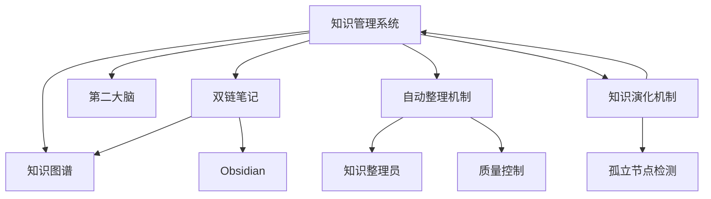

# {{知识图谱}}

## 节点元数据
```yaml
type: concept
domain: 知识管理
level: 模块层
created: 2026-03-24
updated: 2026-03-24
source: openclaw
```

## 概述

知识图谱是知识管理系统的可视化表示，通过节点（概念）和边（关系）展示知识结构。在 Obsidian 中，由 [[双链笔记]] 自动生成，无需额外配置。

## 核心要点

- **节点** - 每个 .md 文件是一个节点
- **边** - `[[双链]]` 形成连接边
- **聚类** - 相关概念自然形成簇群
- **中心度** - 高连接度的节点是关键概念

## 图谱类型

| 类型 | 说明 | 用途 |
|------|------|------|
| 全局图谱 | 显示所有笔记的关系 | 整体结构概览 |
| 本地图谱 | 显示当前笔记的邻居节点 | 上下文理解 |
| 过滤图谱 | 按标签、文件夹等条件筛选 | 专题分析 |

## 系统知识图谱



## 图谱分析价值

- **发现盲点** - 孤立节点表示未充分发展的概念
- **识别核心** - 高连接度节点是知识体系的关键
- **发现关联** - 意外连接揭示跨领域洞察
- **结构优化** - 通过图谱调整笔记组织

## 复杂度控制

- 核心主题图谱 ≤ 15 节点
- 模块层图谱 ≤ 10 节点
- 节点层图谱 ≤ 5 节点

## 相关概念

- [[知识管理系统]] - 所属系统
- [[双链笔记]] - 数据来源
- [[第二大脑]] - 理论基础
- [[Obsidian]] - 实现平台
- [[Mermaid]] - 图表工具
- [[自动整理机制]] - 维护
- [[知识演化机制]] - 优化

---
tags: [知识图谱，可视化，网络分析]
type: concept
domain: 知识管理
links: [知识管理系统，双链笔记，第二大脑，Obsidian, Mermaid, 自动整理机制，知识演化机制]
