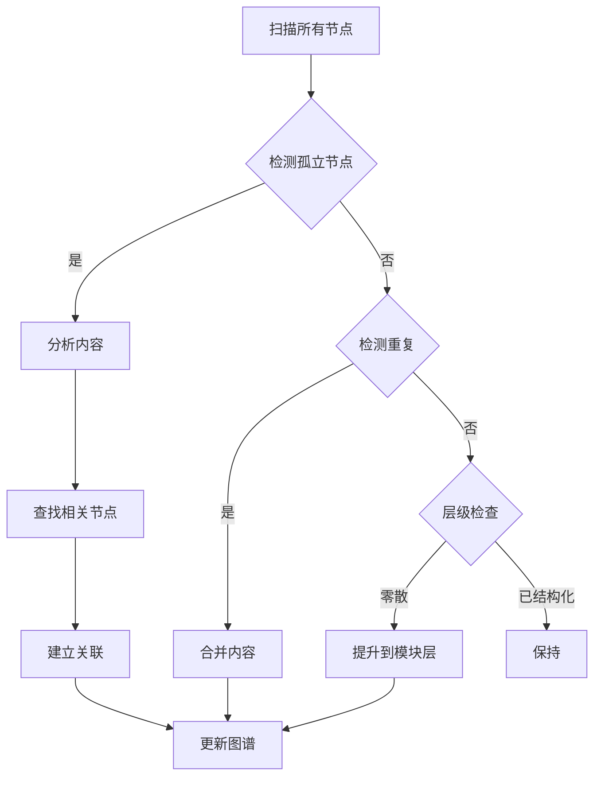

# {{知识演化机制}}

## 节点元数据
```yaml
type: system
domain: 知识管理
level: 模块层
created: 2026-03-24
updated: 2026-03-24
source: openclaw
```

## 概述

知识演化机制负责知识库的长期结构优化，通过识别孤立节点、自动补充关联、合并重复内容，使知识从"散点"自动演化为"有层级、有关系的图谱"。

## 核心要点

- **孤立检测** - 识别无链接或链接过少的节点
- **自动关联** - 基于内容相似度建立新链接
- **重复合并** - 检测并合并相似节点
- **层级提升** - 将零散笔记提升为结构化主题
- **规模控制** - 防止图谱无限扩张

## 演化流程



## 节点类型定义

| 类型 | 说明 | 示例 |
|------|------|------|
| concept | 概念、理论、方法 | [[双链笔记]] |
| system | 系统、机制、流程 | [[自动整理机制]] |
| issue | 问题、故障、解决 | [[Cron 任务故障]] |
| decision | 决策、选择、理由 | [[PARA 分类法选择]] |

## 关系类型

| 关系 | 说明 | 示例 |
|------|------|------|
| 属于 | A 属于 B 的子概念 | [[双链笔记]] 属于 [[知识管理系统]] |
| 依赖 | A 依赖 B 实现 | [[知识图谱]] 依赖 [[双链笔记]] |
| 对比 | A 与 B 对比 | [[双链笔记]] vs [[传统笔记]] |
| 演进 | A 演化为 B | [[笔记方法]] → [[双链笔记]] |

## 层级结构

### 主题层（Theme Layer）
- 核心主题，如 [[知识管理系统]]、[[OpenClaw 架构]]
- 每个主题有独立的 Mermaid 图谱
- 节点数 ≤ 15

### 模块层（Module Layer）
- 功能模块，如 [[双链笔记]]、[[知识图谱]]
- 关联 2-5 个相关节点
- 节点数 ≤ 10

### 节点层（Node Layer）
- 具体概念、工具、方法
- 至少关联 2 个其他节点
- 避免孤立

## 避免失控机制

| 限制 | 规则 | 处理 |
|------|------|------|
| 重复主题 | 检测相似度 > 80% | 合并或标记 |
| 孤立节点 | 链接数 < 2 | 自动补充关联 |
| 图谱规模 | 核心主题 > 15 节点 | 拆分子主题 |
| 循环依赖 | A→B→A | 标记并人工审核 |

## Cron 任务

**🧠 知识演化员**
- ID: `待创建`
- 频率：每天 03:00
- 职责：识别孤立、补充关联、合并重复、层级优化
- 脚本：`scripts/knowledge-evolver.ps1`

## 相关概念

- [[知识管理系统]] - 所属系统
- [[知识图谱]] - 可视化展示
- [[自动整理机制]] - 协同维护
- [[双链笔记]] - 数据基础
- [[质量控制]] - 质量保障

---
tags: [知识演化，结构优化，自动化]
type: system
domain: 知识管理
links: [知识管理系统，知识图谱，自动整理机制，双链笔记，质量控制]
