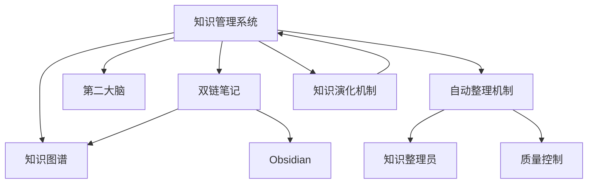

# {{知识管理系统}}

## 节点元数据
```yaml
type: system
domain: 知识管理
level: 主题层
created: 2026-03-24
updated: 2026-03-24
source: openclaw
```

## 概述

知识管理系统是 OpenClaw 的第二大脑核心，通过 [[双链笔记]] 和 [[知识图谱]] 实现结构化知识存储与自动关联。系统采用 PARA 分类法，支持自动整理和演化。

## 核心要点

- **三层架构** - 主题层 → 模块层 → 节点层
- **自动关联** - 双链机制建立知识网络
- **持续演化** - 知识演化员每日优化结构
- **可视化** - Mermaid 图谱展示关系

## 系统架构



## 三层结构

### 主题层（Theme Layer）
- [[知识管理系统]] - 核心主题
- [[OpenClaw 架构]] - 系统架构
- [[AI 系统]] - AI 相关主题

### 模块层（Module Layer）
- [[双链笔记]] - 笔记方法模块
- [[知识图谱]] - 可视化模块
- [[自动整理机制]] - 维护模块
- [[知识演化机制]] - 演化模块

### 节点层（Node Layer）
- 具体概念、工具、方法等

## 子模块关系

| 模块 | 类型 | 关联数 | 说明 |
|------|------|--------|------|
| [[双链笔记]] | concept | 6 | 核心笔记方法 |
| [[知识图谱]] | concept | 7 | 可视化展示 |
| [[第二大脑]] | concept | 5 | 理论基础 |
| [[自动整理机制]] | system | 6 | 日常维护 |
| [[知识演化机制]] | system | 4 | 结构优化 |

## 相关概念

- [[双链笔记]] - 核心方法
- [[知识图谱]] - 可视化
- [[第二大脑]] - 理论基础
- [[自动整理机制]] - 维护
- [[知识演化机制]] - 演化
- [[Obsidian]] - 工具平台
- [[PARA 分类法]] - 组织框架

---
tags: [知识管理，系统，核心主题]
type: system
domain: 知识管理
links: [双链笔记，知识图谱，第二大脑，自动整理机制，知识演化机制]
