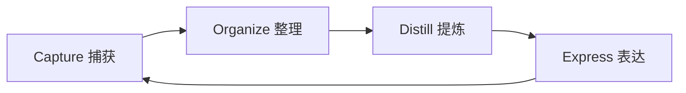
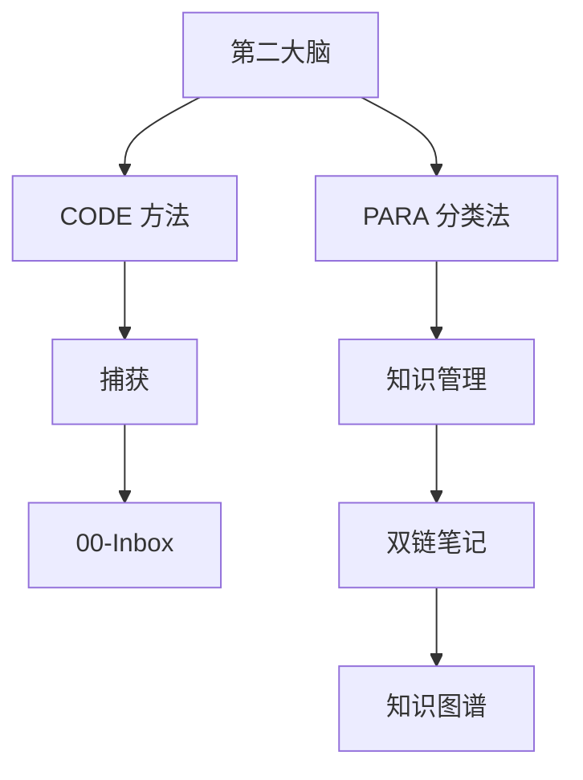

# {{第二大脑}}

## 节点元数据
```yaml
type: concept
domain: 知识管理
level: 模块层
created: 2026-03-24
updated: 2026-03-24
source: openclaw
```

## 概述

第二大脑（Second Brain）是 Tiago Forte 提出的知识管理方法论。核心理念是将大脑的记忆功能外包到数字系统，让大脑专注于思考而非存储。

## 核心要点

- **CODE 方法** - Capture（捕获）、Organize（整理）、Distill（提炼）、Express（表达）
- **外部化记忆** - 将想法、信息存入可靠的外部系统
- **渐进式整理** - 先捕获后整理，避免完美主义瘫痪
- **输出导向** - 知识管理的最终目的是创造价值

## CODE 四步法



### 1. Capture（捕获）
- 记录所有有价值的信息
- 降低捕获门槛，快速记录
- 使用统一入口（如 Inbox）

### 2. Organize（整理）
- 按项目/领域分类
- 建立关联而非严格层级
- 定期回顾和清理

### 3. Distill（提炼）
- 提取核心要点
- 用自己的话重述
- 创建摘要和索引

### 4. Express（表达）
- 将知识转化为输出
- 写作、分享、应用
- 形成知识闭环

## PARA 分类法

| 分类 | 说明 | 示例 |
|------|------|------|
| Projects | 有明确目标的任务 | 知识管理系统开发 |
| Areas | 长期责任范围 | 知识管理、健康 |
| Resources | 参考材料和兴趣 | 双链笔记、AI 技术 |
| Archives | 已完成/不活跃内容 | 旧项目文档 |

## 在本系统中的应用



OpenClaw 的第二大脑实现：
- **自动捕获** - 任务执行结果自动记录
- **智能关联** - 通过 [[双链笔记]] 建立联系
- **定期整理** - [[自动整理机制]] 每日优化
- **知识输出** - 生成报告、摘要、建议

## 相关概念

- [[知识管理系统]] - 实现系统
- [[双链笔记]] - 关联方法
- [[知识图谱]] - 可视化
- [[CODE 方法]] - 核心流程
- [[PARA 分类法]] - 组织框架
- [[自动整理机制]] - 维护机制
- [[知识演化机制]] - 结构优化

---
tags: [知识管理，方法论，TiagoForte,CODE,PARA]
type: concept
domain: 知识管理
links: [知识管理系统，双链笔记，知识图谱，CODE 方法，PARA 分类法，自动整理机制，知识演化机制]
