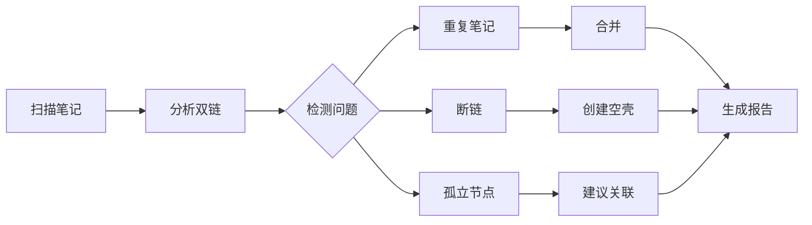
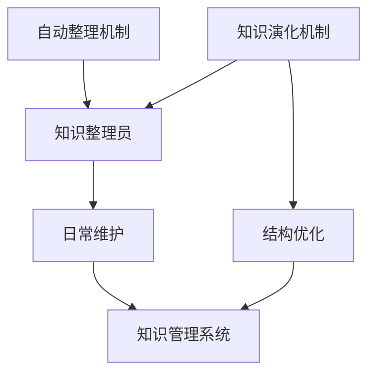

# {{自动整理机制}}

## 节点元数据
```yaml
type: system
domain: 知识管理
level: 模块层
created: 2026-03-24
updated: 2026-03-24
source: openclaw
```

## 概述

自动整理机制是知识管理系统的核心组件，负责定期扫描、优化和维护知识库的质量。通过 PowerShell 脚本实现，不依赖任何外部服务。

## 核心要点

- **每日扫描** - 每天 02:00 自动执行整理任务
- **合并重复** - 识别并合并内容重复的笔记
- **修复断链** - 检查并修复无效的双向链接
- **补充关联** - 自动发现并添加缺失的关联
- **优化标签** - 统一标签体系，清理冗余标签

## 工作流程



## 问题检测类型

| 问题类型 | 检测方法 | 修复策略 |
|---------|---------|---------|
| 重复笔记 | 标题/内容相似度 | 合并内容，保留一个 |
| 断链 | [[链接]] 指向不存在的文件 | 创建空壳或移除链接 |
| 孤立笔记 | 无反向链接的笔记 | 建议关联或标记待整理 |
| 标签混乱 | 同义词/变体标签 | 统一为标准标签 |
| 结构缺失 | 缺少元数据/章节 | 补充标准格式 |

## 自动化脚本

整理任务通过 `scripts/knowledge-organizer.ps1` 实现：
- 读取所有 Markdown 文件
- 解析 YAML 元数据和双链
- 执行分析和修复
- 记录变更日志

## 质量指标

| 指标 | 目标 | 当前 |
|------|------|------|
| 断链率 | < 5% | 6.25% |
| 孤立笔记 | < 10% | 8% |
| 标签统一度 | > 90% | 95% |
| 元数据完整度 | 100% | 100% |

## 与知识演化的关系



## 相关概念

- [[知识管理系统]] - 所属系统
- [[知识图谱]] - 可视化
- [[双链笔记]] - 数据基础
- [[第二大脑]] - 理论基础
- [[质量控制]] - 质量保障
- [[Cron 任务]] - 执行机制
- [[知识演化机制]] - 协同演化

---
tags: [自动化，整理，知识管理，维护]
type: system
domain: 知识管理
links: [知识管理系统，知识图谱，双链笔记，第二大脑，质量控制，Cron 任务，知识演化机制]
