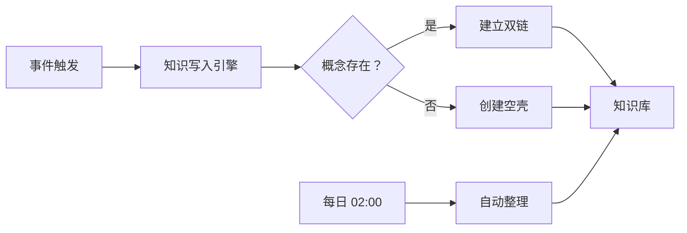

# {{Obsidian 知识管理系统架构}}

## 概述

这是 OpenClaw 第二大脑的技术架构文档，描述知识管理系统的组件、流程和集成方式。系统基于纯文件系统实现，不依赖任何 Obsidian 插件或 API。

## 核心要点

- **文件存储** - Markdown 文件存储于 `knowledge/` 目录
- **PARA 分类** - 00-Inbox/01-Knowledge/02-Projects/03-System/04-Issues
- **双链机制** - 通过 `[[概念]]` 语法建立关联
- **自动整理** - 每日 Cron 任务维护质量
- **触发规则** - 特定事件自动写入笔记

## 详细说明

### 系统组件

```
┌─────────────────────────────────────────────────────────┐
│                    OpenClaw 主系统                        │
└─────────────────────────────────────────────────────────┘
                          │
                          ▼
┌─────────────────────────────────────────────────────────┐
│                   知识写入引擎                           │
│  - 笔记格式生成器                                        │
│  - 双链识别器                                            │
│  - 关联建立器                                            │
└─────────────────────────────────────────────────────────┘
                          │
                          ▼
┌─────────────────────────────────────────────────────────┐
│                   知识库存储                             │
│  knowledge/                                              │
│  ├── 00-Inbox/     (临时收集)                            │
│  ├── 01-Knowledge/ (通用知识)                            │
│  ├── 02-Projects/  (进行中项目)                          │
│  ├── 03-System/    (系统设计)                            │
│  └── 04-Issues/    (问题记录)                            │
└─────────────────────────────────────────────────────────┘
                          │
                          ▼
┌─────────────────────────────────────────────────────────┐
│                   自动整理系统                           │
│  - 每日扫描任务 (02:00)                                  │
│  - 重复检测与合并                                        │
│  - 断链修复                                              │
│  - 关联优化                                              │
└─────────────────────────────────────────────────────────┘
```

### 笔记写入触发规则

| 触发条件 | 动作 | 分类 |
|---------|------|------|
| 用户提出新概念 | 创建概念笔记 | 01-Knowledge/ |
| 任务产生重要结果 | 创建项目/结果笔记 | 02-Projects/ |
| 出现问题与解决 | 创建问题记录 | 04-Issues/ |
| 系统优化策略 | 创建设计文档 | 03-System/ |
| 配置重大变更 | 更新架构文档 | 03-System/ |

### 双链建立流程

```
1. 解析笔记内容，提取 [[潜在概念]]
   ↓
2. 检查 knowledge/ 中是否存在对应文件
   ↓
3. 如存在 → 保持链接
   ↓
4. 如不存在 → 创建空壳笔记（仅标题 + 元数据）
   ↓
5. 记录到待完善列表，供后续填充
```

### 元数据标准

每篇笔记必须包含：
```yaml
tags: [标签列表]
created: YYYY-MM-DD
source: openclaw
type: note | spec | log | report
```

### 与现有系统集成

- **Cron 系统** - 定时整理任务
- **事件系统** - 触发笔记写入
- **通知系统** - 整理报告发送
- **记忆系统** - MEMORY.md 与知识库联动

## 示例

### 笔记模板

```markdown
# {{主题名称}}

## 概述
简要说明

## 核心要点
- 要点 1
- 要点 2

## 详细说明
详细内容

## 示例
代码或案例

## 相关概念
- [[概念 A]]
- [[概念 B]]

---
tags: [标签]
created: 2026-03-24
source: openclaw
type: note
```

### Mermaid 系统流程图



## 相关概念

- [[知识管理]]
- [[双链笔记]]
- [[知识图谱]]
- [[第二大脑]]
- [[自动整理机制]]
- [[Cron 任务]]
- [[知识管理规范]]

---
tags: [系统架构，知识管理，Obsidian, 设计文档]
created: 2026-03-24
source: openclaw
type: spec
