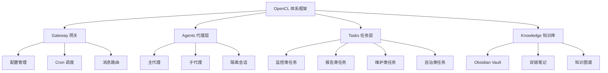
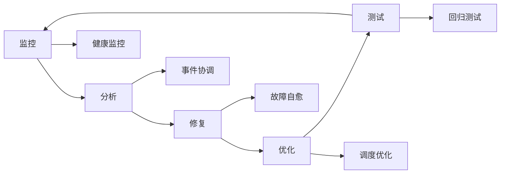

# {{OpenCL 体系框架}}

## 节点元数据
```yaml
type: system
domain: AI 系统
level: 主题层
created: 2026-03-24
updated: 2026-03-24
source: openclaw
```

## 概述

OpenCL 体系框架是 OpenClaw 智能助手的整体架构设计，定义了系统的核心组件、运行流程和自治能力。框架以"自主代理 + 知识管理 + 故障自愈"为核心，实现 7 天无人值守稳定运行。

## 核心要点

- **三层架构** - Gateway → Agents → Tasks
- **自治能力** - 监控→分析→修复→优化闭环
- **知识驱动** - Obsidian 知识库支撑决策
- **情境感知** - 静默时段 + 通知分级

## 系统架构



## 核心组件

### 1. Gateway 网关层
| 组件 | 职责 | 说明 |
|------|------|------|
| 配置管理 | 系统配置 | openclaw.json |
| Cron 调度 | 任务调度 | 30+ Cron 任务 |
| 消息路由 | 渠道通信 | Telegram/WhatsApp/Discord |
| 会话管理 | 会话隔离 | Main/Isolated 会话 |

### 2. Agents 代理层
| 代理类型 | 说明 | 示例 |
|---------|------|------|
| 主代理 | 直接交互 | 用户对话 |
| 子代理 | 并行任务 | 多代理协作 |
| 隔离代理 | Cron 任务 | 后台执行 |

### 3. Tasks 任务层（25+ 任务）

#### 监控类（5 个）
- 📧 邮件监控员 - 每 20 分钟
- 🏥 健康监控员 - 每 2 小时
- 🛡️ 安全审计员 - 每 6 小时
- ⚖️ 资源守护者 - 每 4 小时
- 📝 配置审计师 - 每 4 小时

#### 报告类（5 个）
- 🏃 运动提醒员 - 每天 07:00
- 📰 每日早报 - 每天 08:15
- 🌐 网站监控员 - 每天 08:05
- 📊 运营总监 - 每天 09:00
- 📈 每周总结 - 每周五 17:00

#### 维护类（5 个）
- 💼 项目顾问 - 每天 20:00
- 💾 备份管理员 - 每天 23:00
- 🧹 日志清理员 - 每天 03:00
- 🚨 灾难恢复官 - 每周日 06:00
- 💰 成本分析师 - 每周日 20:00

#### 自治类（3 个）
- 🚑 故障自愈员 - 每 30 分钟
- 📡 事件协调员 - 每 5 分钟
- 🧠 调度优化员 - 每 6 小时

#### 知识类（2 个）
- 🧠 知识整理员 - 每天 02:00
- 🧬 知识演化员 - 每天 03:00

### 4. Knowledge 知识库

**Obsidian Vault 结构**:
```
OpenClaw/
├── 00-Inbox/          # 缓冲区
├── 01-Knowledge/      # 通用知识
├── 02-Projects/       # 项目
├── 03-System/         # 系统设计
└── 04-Issues/         # 问题
```

**核心能力**:
- [[双链笔记]] 建立关联
- [[知识图谱]] 可视化
- [[自动整理机制]] 日常维护
- [[知识演化机制]] 结构优化

## 运行模式

| 模式 | 触发条件 | 动作 |
|------|---------|------|
| 🟢 正常 | 默认 | 所有任务运行 |
| 🟡 降载 | API>80% 或 资源>85% | 暂停低优先级 |
| 🔴 安全 | 资源>95% 或 故障≥5 | 仅核心任务 |
| ⚫ 冻结 | 错误≥10 或 Gateway 故障 | 停止所有任务 |

## 自治闭环



## 情境感知

**静默时段**: 22:00-06:00

**通知分级**:
| 级别 | 工作时间 | 傍晚 | 深夜 |
|------|---------|------|------|
| 🟢 信息 | ✅ | ❌ | ❌ |
| 🟡 警告 | ✅ | ✅ | ❌ (累积) |
| 🔴 紧急 | ✅ | ✅ | ✅ |
| 🔴🔴 危急 | ✅ | ✅ | ✅ |

## 相关概念

- [[知识管理系统]] - 知识支撑
- [[自动整理机制]] - 知识维护
- [[知识演化机制]] - 知识优化
- [[故障自愈员]] - 自治核心
- [[Cron 任务]] - 执行机制
- [[Gateway 配置]] - 基础架构
- [[情境感知静默]] - 通知管理

---
tags: [OpenCL，体系架构，AI 系统，自治系统]
type: system
domain: AI 系统
level: 主题层
links: [知识管理系统，自动整理机制，知识演化机制，故障自愈员，Cron 任务，Gateway 配置，情境感知静默]
