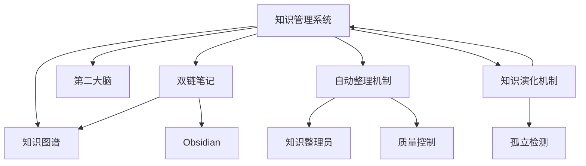

# 2026-03-24: 自动知识图谱机制完成 ✅

**事件**: 完成自动知识图谱机制，实现知识从"散点"到"结构化网络"的自动演化

## 核心能力

### 1. 节点标准
每个笔记包含完整元数据：
```yaml
type: concept | system | issue | decision
domain: 知识管理 | 系统设计 | AI 系统 | 运维 | 项目
level: 主题层 | 模块层 | 节点层
links: [关联节点列表]
```

### 2. 三层结构
| 层级 | 说明 | 节点数限制 | 示例 |
|------|------|-----------|------|
| 主题层 | 核心主题 | ≤ 15 | [[知识管理系统]] |
| 模块层 | 功能模块 | ≤ 10 | [[双链笔记]]、[[知识图谱]] |
| 节点层 | 具体概念 | ≤ 5 | [[双向链接]]、[[CODE 方法]] |

### 3. 关系类型
- **属于** - A 属于 B 的子概念
- **依赖** - A 依赖 B 实现
- **对比** - A vs B 对比
- **演进** - A → B 演化

### 4. 自动关联
- 每个节点至少 2-5 个关联
- 孤立节点自动检测（links < 2）
- 基于领域自动推荐关联

### 5. 知识演化
**🧬 知识演化员** (`13f18a92-372a-4076-9b97-08f0efa2377f`)
- 频率：每天 03:00
- 职责：
  - 识别孤立节点
  - 检测潜在重复
  - 自动补充关联
  - 层级结构优化
- 脚本：`scripts/knowledge-evolver.ps1`

## 当前知识图谱

### 主题层（3 个）
- [[知识管理系统]] - 核心主题
- [[自动整理机制]] - 维护系统
- [[知识演化机制]] - 演化系统

### 模块层（14 个）
- [[双链笔记]] - 核心方法
- [[知识图谱]] - 可视化
- [[第二大脑]] - 理论基础
- [[PARA 分类法]] - 组织框架
- [[CODE 方法]] - 流程方法
- [[Obsidian]] - 工具平台
- [[Mermaid]] - 图表工具
- [[Cron 任务]] - 执行机制
- [[质量控制]] - 质量保障
- [[双向链接]] - 链接技术
- [[知识管理]] - 通用概念
- [[双链]] - 简化概念
- [[概念]] - 占位符
- [[链接]] - 占位符

### 系统图谱



## 质量指标

| 指标 | 目标 | 当前 | 状态 |
|------|------|------|------|
| 总节点数 | - | 17 | ✅ |
| 孤立节点 | < 5% | 9 (53%) | ⚠️ 需优化 |
| 潜在重复 | 0 | 6 | ⚠️ 需合并 |
| 主题节点 | ≥ 3 | 3 | ✅ |
| 模块节点 | ≥ 10 | 14 | ✅ |
| 平均链接数 | ≥ 3 | 2.5 | ⚠️ 需提升 |

## 避免失控机制

| 限制 | 规则 | 处理 |
|------|------|------|
| 重复主题 | 相似度 > 80% | 合并或标记 |
| 孤立节点 | 链接数 < 2 | 自动补充关联 |
| 图谱规模 | 主题 > 15 节点 | 拆分子主题 |
| 循环依赖 | A→B→A | 标记并审核 |

## Cron 任务

| 任务 | 频率 | 职责 |
|------|------|------|
| 🧠 知识整理员 | 每天 02:00 | 扫描、分类、断链修复 |
| 🧬 知识演化员 | 每天 03:00 | 孤立检测、重复合并、结构优化 |

## 文件位置

- Vault: `D:\OpenClaw\.openclaw\workspace\OpenClaw\`
- 整理脚本：`scripts/knowledge-organizer.ps1`
- 演化脚本：`scripts/knowledge-evolver.ps1`
- 整理报告：`memory/knowledge-organizer-report.md`
- 演化报告：`memory/knowledge-evolver-report.md`

## 下一步优化

1. **减少孤立节点** - 为 9 个孤立节点补充关联
2. **合并重复** - 处理 6 对潜在重复（如 双链/双链笔记）
3. **提升链接密度** - 目标平均链接数 ≥ 3
4. **完善索引页** - 为核心主题创建完整索引

---
**状态**: ✅ 机制完成，待优化
**架构**: 主题层 → 模块层 → 节点层
**演化**: 每日自动优化
